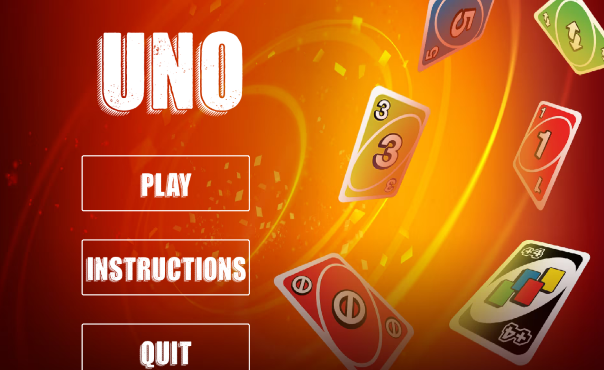
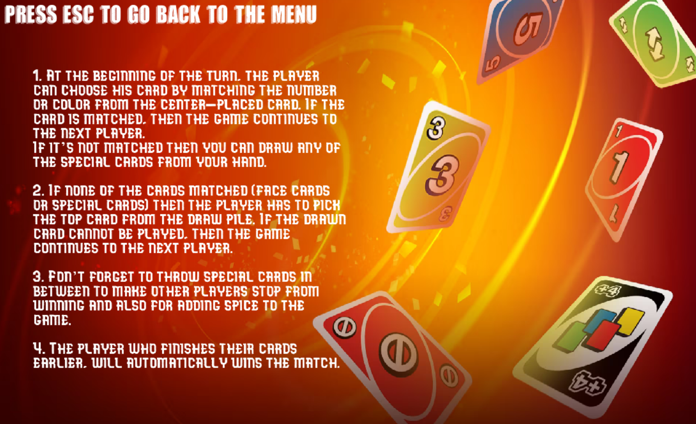
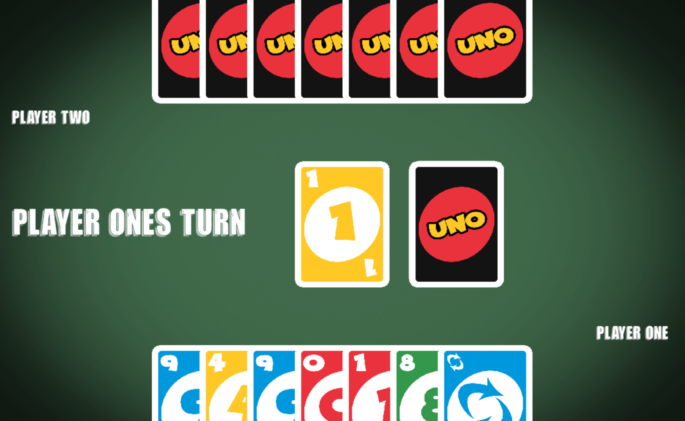

# Multiplayer UNO
This is a basic version of UNO. Each player starts with 7 cards, and the objective of the game is to be 
the person who gets rid of all their cards first.

The control keys are:
- "mouse"
- "right"
- "left"

Used libraries:
- pygame
- socket
- pickle
- _thread
- random
- os
- math


## Setup

Pre-requirements:

* python 3.9 >

## Run the app

First, make sure that you're in the right directory. If you're not, run
```
cd .../ICS3UFinal
```

Open a terminal and run
```
python server.py
```

Open another terminal and run

```shell
python main.py
```

If you have another computer, run the same line again on that computer on a terminal (Must be connected to the same wifi). If you don't have another computer, you can open a new terminal and run the line of code again. 

## Troublshooting

- If you are using two computers, try to turn off the firewall as it may mess up the connection

## Limitations

- Computer that isn't running the server may crash if too much data is being sent per second

## Screenshots






## Rules

Read up on the rules here: **[UNO Rules](https://www.unorules.com/)**